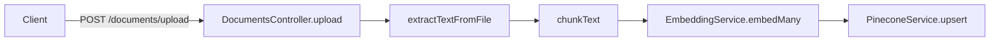

<p align="center">
  <a href="http://nestjs.com/" target="blank"></a>
</p>

[circleci-image]: https://img.shields.io/circleci/build/github/nestjs/nest/master?token=abc123def456
[circleci-url]: https://circleci.com/gh/nestjs/nest

  <p align="center">A progressive <a href="http://nodejs.org" target="_blank">Node.js</a> framework for building efficient and scalable server-side applications.</p>
    <p align="center">
<a href="https://www.npmjs.com/~nestjscore" target="_blank"></a>
<a href="https://www.npmjs.com/~nestjscore" target="_blank"></a>
<a href="https://www.npmjs.com/~nestjscore" target="_blank"></a>
<a href="https://circleci.com/gh/nestjs/nest" target="_blank"></a>
<a href="https://discord.gg/G7Qnnhy" target="_blank"></a>
<a href="https://opencollective.com/nest#backer" target="_blank"></a>
<a href="https://opencollective.com/nest#sponsor" target="_blank"></a>
  <a href="https://paypal.me/kamilmysliwiec" target="_blank"></a>
    <a href="https://opencollective.com/nest#sponsor"  target="_blank"></a>
  <a href="https://twitter.com/nestframework" target="_blank"></a>
</p>
  <!--[](https://opencollective.com/nest#backer)
  [](https://opencollective.com/nest#sponsor)-->

# RAG Policy API

Este projeto expoe uma API REST (NestJS) que:
1) indexa documentos de politica (PDF/.txt) no Pinecone como embeddings vetoriais
2) responde perguntas de politica usando Retrieval-Augmented Generation (RAG)

## PT-BR - Especificacoes Detalhadas

### Visao Geral

O fluxo e dividido em dois recursos principais:

- Indexacao: `POST /documents/upload` (PDF ou texto em multipart)
- Perguntas: `POST /chat` (embed da pergunta + busca no Pinecone + geracao no OpenAI)

O endpoint `GET /api` serve o Swagger UI com base nos DTOs do projeto.

### Arquitetura (mapeada para o codigo)

Principais modulos e responsabilidade:

- `OpenAIModule`: cria o client `OpenAI` e disponibiliza `EmbeddingService`
- `PineconeModule`: cria o `Index` do Pinecone a partir de `PINECONE_API_KEY` e `PINECONE_INDEX_NAME`
- `DocumentsModule`: `DocumentsService` faz extracao de texto, chunking, embeddings e `upsert` no Pinecone
- `ChatModule`: `ChatService` faz busca vetorial no Pinecone, monta contexto e chama `chat.completions`

### Variaveis de Ambiente

Arquivo de referencia: `./.env.example`.

Variaveis esperadas:

```bash
OPENAI_API_KEY=...
PINECONE_API_KEY=...
PINECONE_ENVIRONMENT=...   # presente no .env.example, mas nao e referenciado no PineconeModule atual
PINECONE_INDEX_NAME=...
```

### Desenvolvimento local

O projeto roda a API NestJS localmente e usa Docker Compose apenas para a infraestrutura:

```bash
docker compose up -d
npm install
npm run prisma:push
npm run prisma:generate
npm run start:dev
```

Servicos locais:

- API: `http://localhost:8080`
- Swagger: `http://localhost:8080/api`
- Postgres: `localhost:5432`, database `rag_policy`
- Redis: `localhost:6379`
- MinIO API: `http://localhost:9000`
- MinIO Console: `http://localhost:9001`

O arquivo `.env.example` ja contem valores compativeis com o Compose. Para fluxos de RAG, configure tambem `OPENAI_API_KEY`, `PINECONE_API_KEY` e `PINECONE_INDEX_NAME`.

### CORS e Swagger

Em `src/main.ts`:

- Swagger UI em `GET /api`
- Porta: `process.env.PORT ?? 8080`
- CORS:
  - origin: `http://localhost:3000`
  - methods: `GET, POST, PUT, PATCH, DELETE, OPTIONS`
  - allowedHeaders: `Content-Type, Authorization`

### Endpoints

#### `GET /`

Retorna um health check simples:

```json
"Hello World!"
```

#### `POST /chat`

Descricao: recebe uma pergunta de politica e retorna a resposta gerada, embasada em trechos recuperados do Pinecone.

Request (JSON, `application/json`):

```json
{
  "question": "Qual e a politica para reembolso?",
  "conversationId": "opcional"
}
```

Validacoes:

- `question` e obrigatoria, deve ser `string` e nao pode ser vazia (trim).
- Se `question` for ausente ou vazia, retorna `400` com mensagem:
  - `question is required and must be non-empty`

Response (`200`):

```json
{
  "answer": "texto gerado pelo modelo",
  "sources": [
    {
      "documentTitle": "titulo do documento",
      "sourceLink": "link da fonte"
    }
  ]
}
```

Notas de RAG:

- Pinecone query usa `topK = 5` e `includeMetadata = true`.
- Trechos sao filtrados por relevancia: `score >= 0.5` (`MIN_SCORE`).
- Se nao houver trechos apos o filtro (ou se nao houver `metadata.text`), retorna mensagem de nao encontrado e `sources: []`.
- `conversationId` existe no DTO, mas nao e utilizado no `ChatService` atual (reservado para historico futuro).

#### `POST /documents/upload`

Descricao: indexa um arquivo (PDF ou texto) via `multipart/form-data`.

Request:

- `file`: arquivo (mime permitido: `application/pdf` ou `text/plain`)
- Campos:
  - `title`: string (obrigatorio)
  - `sourceLink`: string (obrigatorio)
  - `createdById`: string (opcional)

Validacoes:

- Tamanho maximo: `10 MB`
- Mime types permitidos: `application/pdf`, `text/plain`

Response (`200`):

Retorna o objeto `doc` criado no `DocumentsService` (metadados persistidos via `metadata` dos chunks no Pinecone):

```json
{
  "id": "uuid",
  "title": "string",
  "sourceLink": "string",
  "fileName": null,
  "status": "active",
  "createdById": null,
  "createdAt": "ISO_DATE_STRING",
  "updatedAt": "ISO_DATE_STRING"
}
```

### Fluxos

#### Fluxo de indexacao (upload)



Extracao de texto:

- `text/plain`: `buffer.toString('utf-8').trim()`
- `application/pdf`: `pdf-parse` e `result.text.trim()`

Chunking:

- normaliza whitespace: `trim()` + colapsa `\\s+` para espaco
- default `maxChunkSize = 800` e `overlap = 100`
- quando possivel, ajusta `end` para o `lastIndexOf(' ', end)` para reduzir cortes no meio de palavras

Estrutura enviada ao Pinecone (`records`):

- `id`: `${documentId}-${chunkIndex}`
- `values`: vetor de embedding
- `metadata`:
  - `documentId`
  - `chunkIndex`
  - `text`
  - `title`
  - `sourceLink`

#### Fluxo de resposta (RAG)

```mermaid
graph LR
Client[Client] -->|POST /chat| ChatCtrl[ChatController.chat]
ChatCtrl --> EmbedQ[EmbeddingService.embed(question)]
EmbedQ --> Query[PineconeService.query topK=5 includeMetadata=true]
Query --> Filter[score >= 0.5]
Filter --> Context[context = join(textChunks, \"\\n\\n---\\n\\n\")]
Filter --> Sources[dedup by documentId -> (title, sourceLink)]
Context --> LLM[OpenAI chat.completions gpt-4o-mini]
LLM --> Resp[ChatResponseDto]
```

Prompt/geracao:

- Modelo de chat: `gpt-4o-mini`
- Sistema: instrucoes para responder apenas com base nas politicas fornecidas (em ingles ou portugues conforme idioma da pergunta) e sempre citar fonte com link; recusa perguntas fora do escopo de politicas.

Fontes retornadas:

- As `sources` sao montadas a partir de `metadata` recuperada do Pinecone (deduplicadas por `documentId`).
- As `sources` nao sao extraidas automaticamente da resposta do modelo.

### Parametros Relevantes

- Chat:
  - `CHAT_MODEL = gpt-4o-mini`
  - `TOP_K = 5`
  - `MIN_SCORE = 0.5`
- Embeddings:
  - `EMBEDDING_MODEL = text-embedding-3-small`
  - `EMBEDDING_DIMENSIONS = 512`

### Notas e Limitacoes

- Nao ha persistencia relacional; os metadados do documento sao reconstruidos a partir dos `metadata` dos chunks no Pinecone.
- Nao existe autenticacao/autorizar nos endpoints (todos sao publicos).
- `PINECONE_ENVIRONMENT` esta no `.env.example`, mas nao e usado no codigo atual do `PineconeModule`.
- O limiar de score (`MIN_SCORE`) depende do index Pinecone e pode exigir ajuste.

## EN - Detailed Specs (Same Behavior)

### What the API does

- Index policies: `POST /documents/upload` (multipart PDF or plain text) -> extract -> chunk -> embed -> Pinecone upsert.
- Ask policy questions: `POST /chat` -> embed question -> Pinecone topK search with metadata -> filter by `score >= 0.5` -> build context + sources -> call OpenAI chat completions (`gpt-4o-mini`).

### Endpoints quick reference

- `GET /` -> `"Hello World!"`
- `POST /chat` -> `{ "question": "string", "conversationId": "optional" }`
- `POST /documents/upload` -> `file` (PDF or text/plain, <= 10MB), plus `title`, `sourceLink`, `createdById`?

### Environment variables

```bash
OPENAI_API_KEY=...
PINECONE_API_KEY=...
PINECONE_ENVIRONMENT=...   # present in .env.example, not used in PineconeModule
PINECONE_INDEX_NAME=...
```

### Key RAG parameters

- Pinecone query: `topK=5`, `includeMetadata=true`
- Relevance filter: `score >= 0.5`
- Embeddings: `text-embedding-3-small`, dimensions `512`
- Chunking defaults: `maxChunkSize=800`, `overlap=100`
